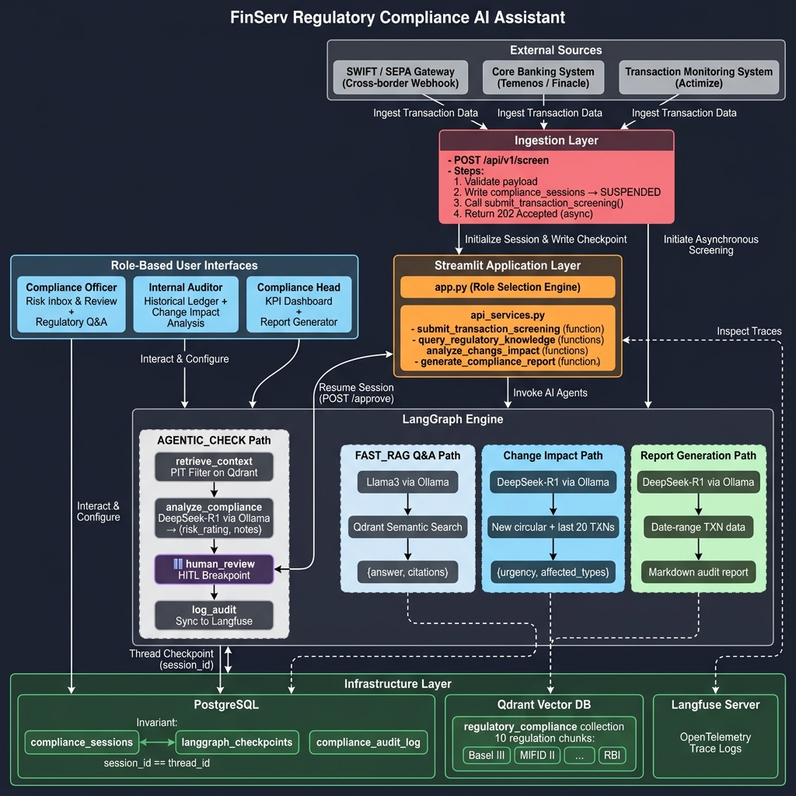
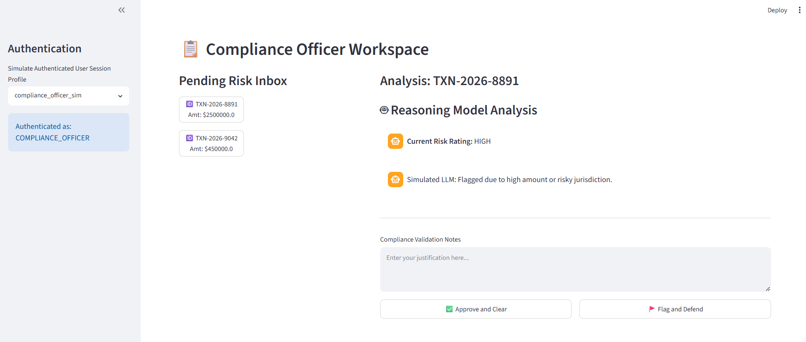
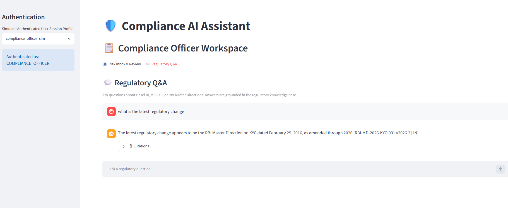
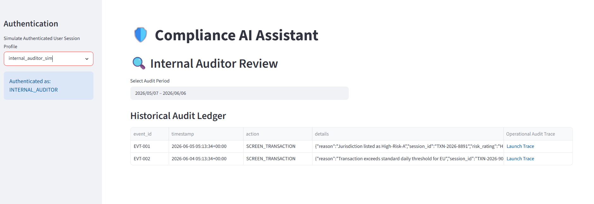
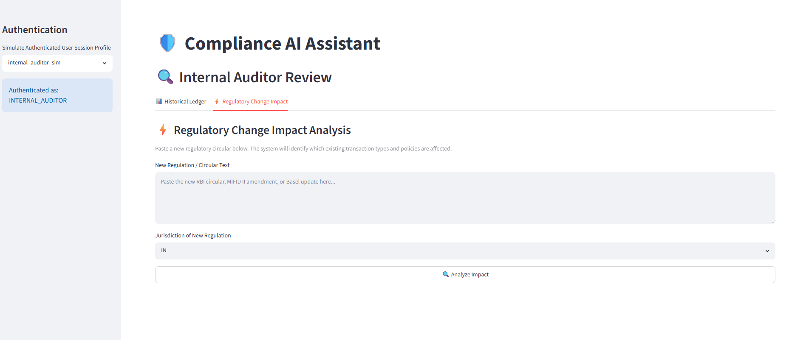
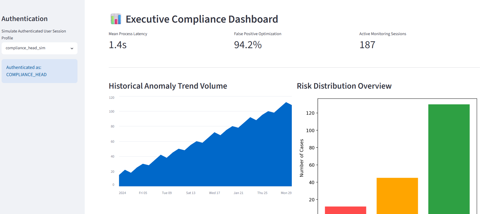

# 🏦 FinServ Global Regulatory Compliance Assistant

> **A self-hosted, LLM-powered compliance engine** that screens cross-border financial transactions, answers regulatory questions from a versioned knowledge base, assesses the impact of new circulars, and generates audit-ready reports — all without sending a single byte of financial data to external cloud APIs.

[](LICENSE)


---

## Architecture

<p align="center">
  
</p>

<details>
<summary>📐 View Mermaid source</summary>

The full diagram source is in [`architecture.mermaid`](architecture.mermaid).
</details>

---

## Core Scenarios

| # | Scenario | Path | LLM | UI Location |
|---|----------|------|-----|-------------|
| 1 | **Regulatory Q&A** — _"What are the Tier 1 capital requirements under Basel III?"_ | `FAST_RAG` | Llama 3 8B | Compliance Officer → Q&A tab |
| 2 | **Transaction Screening** — Risk-rate a $5.5M transfer to a sanctioned zone | `AGENTIC_CHECK` | DeepSeek-R1 | Compliance Officer → Risk Inbox |
| 3 | **Regulatory Change Impact** — Paste a new RBI circular, see which TXNs are affected | `FAST_RAG` | DeepSeek-R1 | Internal Auditor → Change Impact tab |
| 4 | **Audit Report Generation** — Structured Markdown report for a date range | `FAST_RAG` | DeepSeek-R1 | Compliance Head → Generate Report tab |

---

## Transaction Lifecycle — End-to-End Flow

The following traces a single high-risk cross-border transaction from ingestion to human resolution:

```
External Source (SWIFT / Core Banking / TMS)
        │
        ▼  Webhook POST
┌─────────────────────────────────────────────────────────────────┐
│  Ingestion Layer                                                │
│  (Production: FastAPI  |  Prototype: simulate_live_transaction) │
│                                                                 │
│  1. Validate payload (amount, jurisdiction, counterparty)       │
│  2. INSERT INTO compliance_sessions (status = 'SUSPENDED')      │
│  3. Call submit_transaction_screening(session_id, payload)      │
│  4. Return 202 Accepted immediately — caller is NOT blocked     │
└───────────────────────────┬─────────────────────────────────────┘
                            │  async
                            ▼
┌─────────────────────────────────────────────────────────────────┐
│  LangGraph State Machine (graph.py)                             │
│                                                                 │
│  Node 1: retrieve_context                                       │
│    → Queries Qdrant with PIT temporal filter                    │
│                                                                 │
│  Node 2: analyze_compliance                                     │
│    → ChatOllama(model="deepseek-r1")                            │
│    → System prompt from config/prompts.yaml                     │
│    → Returns: { risk_rating: "HIGH", notes: "..." }             │
│                                                                 │
│  ⏸ Node 3: human_review  ← INTERRUPT_BEFORE                    │
│    → Graph PAUSES. State snapshot → PostgreSQL checkpoint        │
│    → Key: thread_id == session_id (Unified Data Footprint)      │
└───────────────────────────┬─────────────────────────────────────┘
                            │
                            ▼  Officer opens Streamlit UI
┌─────────────────────────────────────────────────────────────────┐
│  Compliance Officer Review (app.py)                             │
│                                                                 │
│  • Reads paused checkpoint from PostgreSQL                      │
│  • Displays DeepSeek-R1's reasoning + risk rating               │
│  • Officer enters justification notes                           │
│  • Clicks: [✅ Approve and Clear] or [🚩 Flag and Defend]       │
└───────────────────────────┬─────────────────────────────────────┘
                            │
                            ▼  resume_workflow_checkpoint()
┌─────────────────────────────────────────────────────────────────┐
│  Graph Resumes                                                  │
│                                                                 │
│  Node 4: log_audit                                              │
│    → Syncs trace to Langfuse                                    │
│    → UPDATE compliance_sessions SET status = 'APPROVED'         │
│    → Transaction exits Pending Inbox                            │
└─────────────────────────────────────────────────────────────────┘
```

---

## UI Screenshots

<table>
<tr>
<td width="50%">

**Compliance Officer — Risk Inbox & Review**


</td>
<td width="50%">

**Compliance Officer — Regulatory Q&A**


</td>
</tr>
<tr>
<td width="50%">

**Internal Auditor — Ledger & Trace Links**


</td>
<td width="50%">

**Internal Auditor — Regulatory Change Impact**


</td>
</tr>
<tr>
<td colspan="2">

**Compliance Head — Executive KPI Dashboard**


</td>
</tr>
</table>

---

## Tech Stack

| Layer | Technology | Rationale |
|-------|-----------|-----------|
| **LLM (Reasoning)** | DeepSeek-R1-7B via Ollama | Self-hosted; zero data egress; 7B parameters sufficient for structured JSON compliance output |
| **LLM (Routing/Q&A)** | Llama 3 8B via Ollama | Fast inference for sub-second RAG responses on factual queries |
| **Agent Framework** | LangGraph | Deterministic state machine with `interrupt_before` HITL breakpoints; compiles to a directed graph with typed state |
| **Checkpointing** | langgraph-checkpoint-postgres | Binary state snapshots co-located with business data; `session_id == thread_id` invariant eliminates Redis |
| **Vector Store** | Qdrant (self-hosted) | PIT temporal filtering on `effective_start`/`effective_end`/`status` metadata; cosine similarity with `all-MiniLM-L6-v2` embeddings |
| **Database** | PostgreSQL 15 | Unified footprint: `compliance_sessions`, `langgraph_checkpoints`, `compliance_audit_log` in a single instance |
| **Frontend** | Streamlit | Role-based workspace with tabs; chat interface for Q&A; report download buttons |
| **Observability** | Langfuse | OpenTelemetry trace trees with deep-linkable audit URLs |
| **Configuration** | YAML (frozen dataclasses) | `config.yaml` for infra, `prompts.yaml` for LLM templates; zero hardcoded strings per `agents.md` guardrails |

---

## Project Structure

```
regulatory-compliance-assistant/
├── config/
│   ├── config.yaml              # Infrastructure endpoints (DB, Qdrant, Ollama)
│   └── prompts.yaml             # All LLM system prompts (4 scenarios)
├── data/
│   ├── manifest.json            # 10 regulatory chunks (Basel III, MiFID II, RBI)
│   └── raw_regulations/         # Source PDFs
│       ├── Basel_III_Consolidated.pdf
│       ├── MiFID_II_EU_Directive.pdf
│       └── RBI_Master_Directions_2026.pdf
├── src/
│   ├── app.py                   # Streamlit UI — 3 role-based workspaces
│   ├── api_services.py          # Business logic — all 4 scenario functions
│   ├── graph.py                 # LangGraph engine — 4 nodes + HITL breakpoint
│   ├── database.py              # PostgreSQL connection pool (psycopg3, autocommit)
│   ├── config_loader.py         # Frozen dataclass config reader
│   └── ingestion.py             # Qdrant regulatory document ingestor
├── scripts/
│   ├── simulate_live_transaction.py  # Inject 5 realistic TXNs through the LLM
│   ├── seed_graph_states.py          # Push DB records through graph for checkpoints
│   └── verify_scenarios.py           # End-to-end verification of all 4 scenarios
├── tests/
│   ├── results/                 # UI screenshots from test runs
│   └── test_api_services.py     # Unit tests
├── docs/
│   └── architecture_generated.png
├── architecture.mermaid         # Full system diagram (Mermaid source)
├── assessment_report.md         # Detailed architecture assessment (ATAM framework)
├── agents.md                    # Coding guardrails & development principles
├── docker-compose.yaml          # PostgreSQL + Qdrant containers
├── init.sql                     # Idempotent schema + seed data
└── requirements.txt
```

---

## Quick Start

### Prerequisites
- Python 3.12+
- Docker & Docker Compose
- [Ollama](https://ollama.com/) installed locally

### 1. Start Infrastructure

```bash
docker compose up -d
```

This launches PostgreSQL (port 5432) and Qdrant (port 6333).

### 2. Install Dependencies

```bash
python -m venv venv
venv\Scripts\activate        # Windows
# source venv/bin/activate   # macOS/Linux

pip install -r requirements.txt
```

### 3. Pull LLM Models

```bash
ollama pull deepseek-r1
ollama pull llama3
```

### 4. Seed the Knowledge Base

```bash
python -m src.ingestion
```

This embeds 10 regulatory chunks into the Qdrant `regulatory_compliance` collection.

### 5. Simulate Transactions

```bash
python scripts/simulate_live_transaction.py
```

Injects 5 diverse cross-border transactions through the DeepSeek-R1 engine. Each transaction pauses at the `human_review` breakpoint, ready for officer review.

### 6. Launch the Application

```bash
streamlit run src/app.py
```

Open `http://localhost:8501` and select a persona from the sidebar.

---

## Design Decisions

The full ATAM-style quality-attribute trade-off analysis is in [`assessment_report.md`](assessment_report.md). Key decisions:

| Decision | Trade-off | Outcome |
|----------|-----------|---------|
| **Self-hosted LLMs** (no cloud APIs) | Slower cold-start vs. zero data egress | GDPR/RBI data localization compliance guaranteed |
| **Dual-path routing** (FAST_RAG vs. AGENTIC_CHECK) | Added classification overhead vs. latency optimization | Simple Q&A returns in ~1s; complex screening takes 3–5s with full audit trail |
| **Unified PostgreSQL** (no Redis) | Single point of failure vs. operational simplicity | One DB handles business state, agent checkpoints, and audit logs with `session_id == thread_id` invariant |
| **PIT temporal filtering** (Qdrant metadata) | Storage overhead per chunk vs. historical accuracy | Auditors can verify decisions against the regulations that were active at transaction time |

---

## Regulatory Knowledge Base

The Qdrant collection `regulatory_compliance` is seeded with chunked excerpts across three jurisdictions:

| Framework | Jurisdiction | Documents | Coverage |
|-----------|-------------|-----------|----------|
| **Basel III** (2023 rev.) | US / Global | 3 chunks | CET1 ratios, Tier 1 requirements, LCR/HQLA |
| **MiFID II** (2024 amend.) | EU | 3 chunks | Best execution, T+1 reporting, SI thresholds |
| **RBI Master Directions** (2026) | India | 3 chunks | FEMA/LRS limits, KYC/CDD/EDD, CRAR ratios |
| **FATF Sanctions** | Global | 1 chunk | Recommendation 6, OFAC/UN/EU sanctions screening |

---

## License

Apache 2.0 — see [LICENSE](LICENSE).
